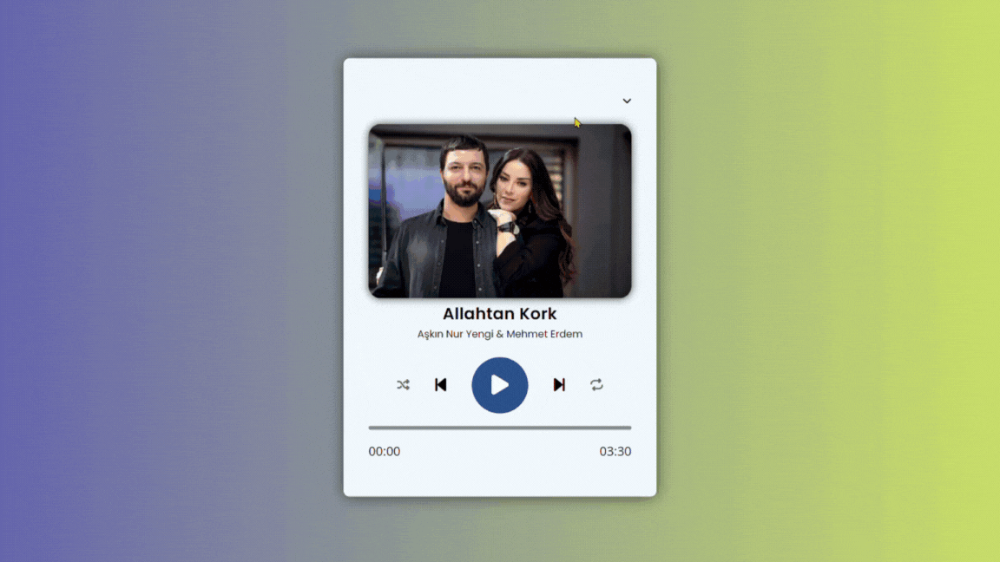

# music-player

Technologies Used
HTML: HTML was used for the structural and content components of the project.

CSS: CSS was utilized to add style and visual layout to the project.
JavaScript: JavaScript was employed for the dynamic features of the project.

Web Audio API: The Web Audio API was utilized to handle functionalities like playing, pausing, and controlling audio files.

SVG: SVG (Scalable Vector Graphics) format was used for visual elements.

Git and GitHub: Git and GitHub were used for version control and collaboration on the project.

## GİF

